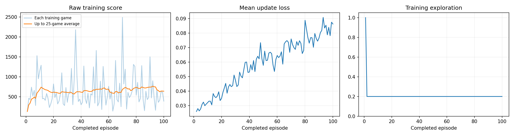
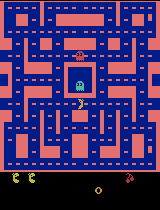

# Ms. Pac-Man DQN Agent — Class 3 Assignment

## Overview
This repository trains a Deep Q-Network (DQN) agent to play Ms. Pac-Man, using the provided notebook. The notebook installs its own dependencies and runs on Google Colab with a T4 GPU.

**To run it:** open `pacman_dqn.ipynb` in Google Colab, select Runtime → Change runtime type → T4 GPU, edit the three hyperparameters in Section 1 if you want different values, and choose Runtime → Run all.

## My Hyperparameters

| Hyperparameter | Value | Why |
|---|---|---|
| Exploration | 0.20 | Balances trying new moves with using what the agent has learned |
| Episodes | 100 | Enough games for the agent to start learning basic patterns, beyond just a setup check |
| Learning rate | 0.0001 | The suggested starting value, kept for stable training |

## Prediction vs. Outcome

**My prediction:** I expected these settings to produce a modest score improvement because 100 episodes should let the agent learn basic patterns.

**What happened:** mean score before = 492.0; after = 468.0 — it went down slightly. The trained and untrained gameplay looked about the same.

**One limitation:** the training loss kept rising instead of dropping, so the agent didn't really learn a stable strategy in 100 episodes.

**My next experiment:** change only the learning rate to 0.00005 and keep the other two settings fixed, to see if slower updates help the loss stabilize.

## Training Details

- Completed episodes: 100/100
- Total decisions: ~58,500
- Learning updates: ~14,376
- Elapsed time: ~3.7 minutes
- Hardware: Google Colab, T4 GPU

## How the Agent Works (Plain Language)

- **Observations:** four grayscale game screens (frames), stacked together, so the agent can perceive motion.
- **Actions:** joystick moves (up, down, left, right, and combinations).
- **Rewards:** points earned in the game (eating pellets, fruit, ghosts). Training rewards are clipped between -1 and 1, but all reported scores are the raw game scores.

## Results

### Training Dashboard

### Evaluation Scores (5 seeds, 5% exploration, same before/after)

| Game | Before | After |
|---|---|---|
| 1 | 350 | 680 |
| 2 | 500 | 570 |
| 3 | 320 | 360 |
| 4 | 800 | 230 |
| 5 | 490 | 500 |
| **Mean** | **492.0** | **468.0** |

Full data: [comparison.json](results/comparison.json)

### Gameplay GIFs

**Untrained agent:**

**Progress at 25 episodes:**

**Progress at 50 episodes:**

**Progress at 75 episodes:**

**Final (100 episodes):**

**Best trained gameplay:**

## Data Files

- [config.json](results/config.json) — hyperparameters and hardware/package versions
- [training.csv](results/training.csv) — full training history
- [training_summary.json](results/training_summary.json) — training summary
- [comparison.json](results/comparison.json) — before/after evaluation scores

## Model Checkpoints

Model checkpoints (`.pt` files, ~6.6 MB each) are kept in the local results ZIP and are not uploaded to this repository, per assignment guidance to avoid large files on GitHub.

## Notebook

The full executed notebook with all outputs is [pacman_dqn.ipynb](pacman_dqn.ipynb).
